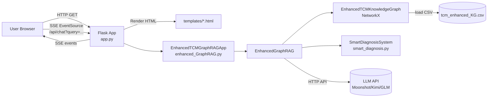

# 01 - 整体架构

## 1.1 组件图

## 1.2 在线请求主链路（从用户输入到输出）

1. 前端对话页通过 `EventSource` 连接 SSE 接口 `/api/chat?query=...`（见 [chat.html](file:///workspace/templates/chat.html#L266-L366)）。
2. Flask 入口 [handle_chat_api](file:///workspace/app.py#L183-L213) 返回 `text/event-stream`，由 [generate_step_by_step_streaming_response](file:///workspace/app.py#L86-L173) 生成事件流。
3. `generate_step_by_step_streaming_response` 按“分步思考 → 最终答案”流程：
   - 意图/关键词抽取：`rag_instance.extract_keywords_and_intent(query)`（见 [app.py](file:///workspace/app.py#L102-L116)）
   - 图谱检索：`rag_instance.retrieve_relevant_knowledge(...)`（见 [app.py](file:///workspace/app.py#L117-L127)）
   - 图谱侧回答流：`rag_instance.generate_graphrag_response_stream(...)`（见 [app.py](file:///workspace/app.py#L128-L136)）
   - 通用 LLM 回答流：`rag_instance.get_general_kimi_response_stream(query)`（见 [app.py](file:///workspace/app.py#L137-L146)）
   - 综合总结：`rag_instance.synthesize_responses(...)`（见 [app.py](file:///workspace/app.py#L149-L166)）
4. 前端按 SSE 事件类型进行渲染（思考面板 + 最终答案面板）（见 [chat.html](file:///workspace/templates/chat.html#L268-L350)）。

## 1.3 两种工作模式（一般问答 vs 智能辨证）

模式切换由 `EnhancedGraphRAG.extract_keywords_and_intent` 判断（见 [enhanced_GraphRAG.py](file:///workspace/enhanced_GraphRAG.py#L195-L213)）：

- 一般知识查询
  - 主要依赖：图谱关键字检索（`_retrieve_general_knowledge`）+ LLM 生成解释（`generate_general_response_stream`）
- 智能辨证分析
  - 主要依赖：`SmartDiagnosisSystem.smart_diagnosis_analysis`（基于图谱映射与可解释推理），并将推理文本分段流式输出

## 1.4 离线数据链路（知识图谱构建）

增强版图谱由 [enhanced_TCMKG.py](file:///workspace/data/enhanced_TCMKG.py) 构建，核心特点：

- 输入：经典医籍 `data/src/classicals/*.txt`（需自行补充，见 [README.md](file:///workspace/README.md#L82-L90)）+ 现代临床 `data/medical_case/*.txt`
- 过程：按章节/分块调用 LLM 抽取三元组 → 落盘到 `tcm_enhanced_KG.csv`，并用 `processing_status_enhanced_KG.json` 支持断点续跑
- 输出：`tcm_enhanced_KG.csv`（Subject/Predicate/Object + 溯源字段 SourceName/SourceChapter/SourceType）

