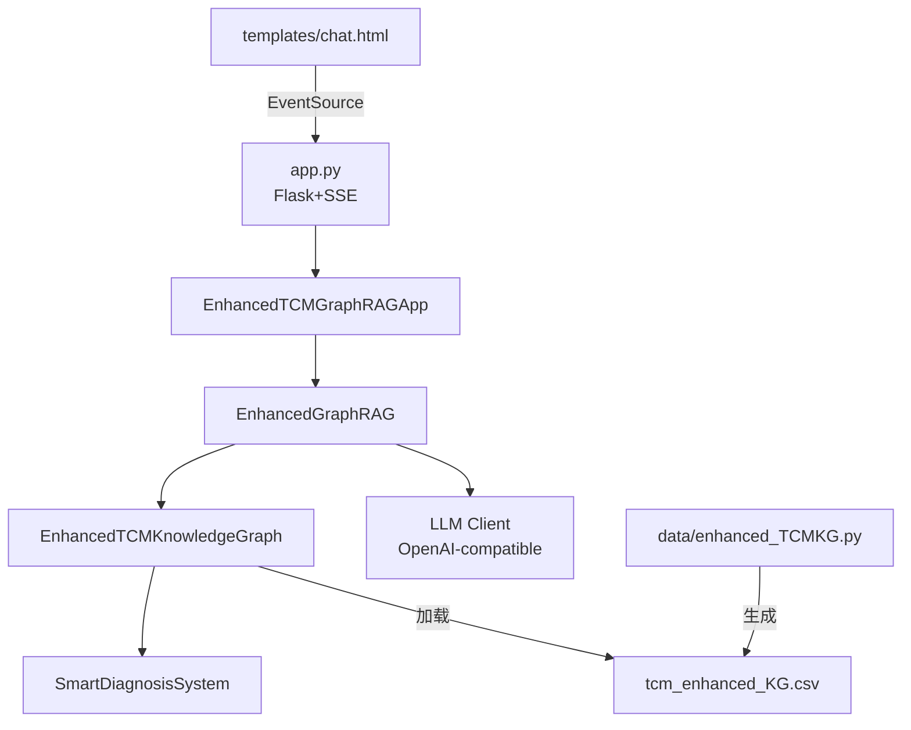

# 02 - 主要模块与依赖关系

## 2.1 模块分层

- Web 层：Flask 路由、静态资源、SSE 输出协议
  - 入口：[app.py](file:///workspace/app.py)
- 应用编排层：意图识别、图谱检索、LLM 调用、结果综合
  - 实现：[enhanced_GraphRAG.py](file:///workspace/enhanced_GraphRAG.py)
- 领域推理层：智能辨证（症状/舌象/脉象抽取 + 证候/方药推断 + 可解释输出）
  - 实现：[smart_diagnosis.py](file:///workspace/smart_diagnosis.py)
- 数据构建层：从经典医籍与临床文本抽取三元组，生成增强版图谱 CSV
  - 实现：[enhanced_TCMKG.py](file:///workspace/data/enhanced_TCMKG.py)
- 前端展示层：对话 UI、SSE 渲染、基础样式
  - 页面：[chat.html](file:///workspace/templates/chat.html)，样式：[style.css](file:///workspace/static/css/style.css)

## 2.2 内部依赖关系

## 2.3 Web 层（app.py）

**职责**

- 初始化 GraphRAG 应用实例（增强版优先，原版回退）
- 提供页面路由（欢迎页/对话页）
- 提供 SSE 接口 `/api/chat`，将后端的“分步过程”与“最终答案”实时推送到前端

**关键点**

- 增强版导入与实例化：[app.py](file:///workspace/app.py#L17-L83)
- SSE 事件生成器：[generate_step_by_step_streaming_response](file:///workspace/app.py#L86-L173)
- 路由：
  - `/` → `welcome.html`：[welcome](file:///workspace/app.py#L175-L178)
  - `/chat_page` → `chat.html`：[chat_ui_page](file:///workspace/app.py#L179-L182)
  - `/api/chat` → SSE：[handle_chat_api](file:///workspace/app.py#L183-L213)

**兼容性提示**

- 代码尝试回退导入 `GraphRAG.py`（见 [app.py](file:///workspace/app.py#L31-L40)），但当前仓库未包含该文件；若要启用原版模式，需要补齐对应实现。

## 2.4 应用编排层（enhanced_GraphRAG.py）

### EnhancedTCMGraphRAGApp

- 职责：对外提供“处理查询”的应用壳，持有 `self.rag: EnhancedGraphRAG`
- 关键函数：
  - 初始化：`__init__(csv_path)`（见 [EnhancedTCMGraphRAGApp](file:///workspace/enhanced_GraphRAG.py#L508-L519)）
  - 同步处理：`process_query(query) -> Dict`（见 [process_query](file:///workspace/enhanced_GraphRAG.py#L520-L568)）

### EnhancedGraphRAG

- 职责：意图识别 → 图谱检索 →（辨证/一般）回答生成 → 综合总结
- 关键函数：
  - 意图识别：`extract_keywords_and_intent(query) -> Dict`（见 [extract_keywords_and_intent](file:///workspace/enhanced_GraphRAG.py#L195-L213)）
  - 知识检索：`retrieve_relevant_knowledge(query, extracted_info) -> List[Dict]`（见 [retrieve_relevant_knowledge](file:///workspace/enhanced_GraphRAG.py#L258-L264)）
  - 图谱侧回答流（分支：辨证/一般）：`generate_graphrag_response_stream(query, context, intent)`（见 [generate_graphrag_response_stream](file:///workspace/enhanced_GraphRAG.py#L402-L411)）
  - 通用回答流：`get_general_kimi_response_stream(query)`（见 [get_general_kimi_response_stream](file:///workspace/enhanced_GraphRAG.py#L447-L466)）
  - 综合总结流：`synthesize_responses(query, graphrag_response, general_response)`（见 [synthesize_responses](file:///workspace/enhanced_GraphRAG.py#L467-L506)）

### EnhancedTCMKnowledgeGraph

- 职责：加载 CSV → 构建 NetworkX 图 → 提供辨证相关三元组过滤 → 持有并初始化 `SmartDiagnosisSystem`
- 关键函数：
  - 加载：`load_from_csv(csv_path)`（见 [load_from_csv](file:///workspace/enhanced_GraphRAG.py#L63-L101)）
  - 辨证相关三元组：`get_diagnosis_related_triples()`（见 [get_diagnosis_related_triples](file:///workspace/enhanced_GraphRAG.py#L121-L137)）
  - 辨证入口：`smart_diagnosis_query(patient_description)`（见 [smart_diagnosis_query](file:///workspace/enhanced_GraphRAG.py#L138-L144)）

## 2.5 智能辨证层（smart_diagnosis.py）

**职责**

- 从患者描述中抽取症状/舌象/脉象（优先 LLM，失败则降级到规则抽取）
- 基于图谱映射做证候候选推断，并给出方剂/药材建议（若图谱中存在相应关系）
- 生成面向 UI 的可解释推理过程文本

**关键数据结构（映射表）**

- 症状→疾病：`symptom_disease_map`
- 舌象→疾病：`tongue_disease_map`
- 脉象→疾病：`pulse_disease_map`
- 证候→疾病/证候→方剂/方剂→药材：`syndrome_disease_map` / `syndrome_formula_map` / `formula_herb_map`
  - 定义见 [SmartDiagnosisSystem.__init__](file:///workspace/smart_diagnosis.py#L37-L57)

**关键函数**

- 图谱加载与映射构建：`load_knowledge_graph(csv_path)`（见 [load_knowledge_graph](file:///workspace/smart_diagnosis.py#L94-L127)）
- LLM 抽取：`_call_llm_for_extraction(text)`（见 [\_call_llm_for_extraction](file:///workspace/smart_diagnosis.py#L185-L239)）
- 主流程：`smart_diagnosis_analysis(patient_description)`（见 [smart_diagnosis_analysis](file:///workspace/smart_diagnosis.py#L398-L450)）
- 可解释输出：`explain_diagnosis_logic(diagnosis_result)`（见 [explain_diagnosis_logic](file:///workspace/smart_diagnosis.py#L481-L531)）

## 2.6 数据构建层（data/enhanced_TCMKG.py）

**职责**

- 将经典医籍/临床文本分块后调用 LLM 抽取增强版三元组
- 生成 `tcm_enhanced_KG.csv`，并维护断点续跑状态 `processing_status_enhanced_KG.json`

**关键函数**

- LLM 客户端：`get_llm_client()`（见 [get_llm_client](file:///workspace/data/enhanced_TCMKG.py#L42-L61)）
- Prompt 构建：`create_enhanced_triple_extraction_prompt(...)`（见 [create_enhanced_triple_extraction_prompt](file:///workspace/data/enhanced_TCMKG.py#L75-L159)）
- 临床过滤：`is_valid_clinical_triple(...)`（见 [is_valid_clinical_triple](file:///workspace/data/enhanced_TCMKG.py#L161-L199)）
- 抽取调用：`extract_enhanced_triples_with_llm(...)`（见 [extract_enhanced_triples_with_llm](file:///workspace/data/enhanced_TCMKG.py#L201-L283)）
- 主流程：`main()`（见 [main](file:///workspace/data/enhanced_TCMKG.py#L605-L723)）

